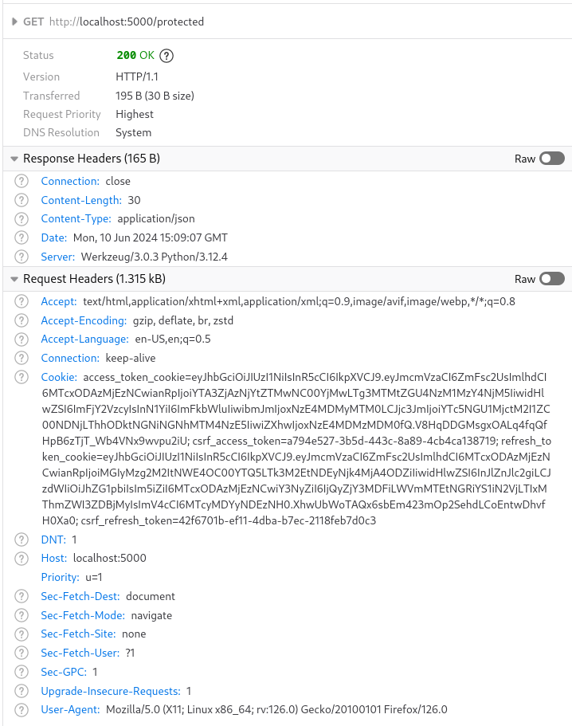

# Secure Coding Project

```bash
docker compose up --build
```

## Modules

Each module needs to be adequately implemented to pass the learning outcome.

### Module 1 (15 points)

> Use tools OWASP ZAP and Burp Suite to scan your application for
> vulnerabilities. Choose three most significant vulnerabilities, document them,
> fix them and re-scan the application to prove that the vulnerabilities are
> fixed.

When running the OWASP ZAP scan, the following significant vulnerabilities were
found:

- Cross Site Scripting (Reflected)
- SQL Injection - MySQL
- Server Side Template Injection


Cross Site Scripting (Reflected) and Server Side Template Injection were fixed
by escaping the user input in the `/hello` route.

```python
# From
@app.route('/hello', methods=['GET'])
def hello():
    name = request.args.get('name', 'World')
    return render_template_string("<h1>Hello, {}!</h1>".format(name))

# To
@app.route('/hello', methods=['GET'])
def hello():
    name = request.args.get('name', 'World')
    return render_template_string("<h1>Hello, {{ name }}!</h1>", name=name)
```

SQL Injection was fixed by using SQLAlchemy's ORM to interact with the database.

```python
# From
@app.route('/login', methods=['POST', 'GET'])
def login():
    if request.method == 'POST':
        username = request.form['username']
        password = request.form['password']
        user = db.session.execute(text(f"SELECT * FROM user WHERE username='{username}' AND password='{password}'")).fetchone()
        if user:
            return jsonify(msg='Login Successful')
        return 'Login Failed', 401
    ...

# To
@app.route('/login', methods=['POST', 'GET'])
def login():
    if request.method == 'POST':
        username = request.form['username']
        password = request.form['password']
        user = User.query.filter_by(username=username, password=password).first()
        if user:
            return jsonify(msg='Login Successful')
        return 'Login Failed', 401
    ...
```


### Module 2 (15 points)

> Use SonarQube tool and scan your application for the bugs. Choose three most
> significant bugs, document them, fix them and re-scan the application to prove
> that the bugs are fixed.

Since we've used SonarQube only in Maven projects during the labs, I've followed
the instructions here: https://dev.to/mbaoma/sonarqube-as-code-health-checker-for-flask-project-3h94.

Once the setup was done, the command `sonar-scanner` was run to scan the
project.

```bash
sonar-scanner \
    -Dsonar.projectKey=SonarQube---Project \
    -Dsonar.sources=. \
    -Dsonar.host.url=http://localhost:9000 \
    -Dsonar.token=sqp_d8dc603256b62a9a97d2c025090baa62629002d9
```

The following issues were found:


- Don't disclose "Flask" secret keys. (L14)
- Revoke and change this password, as it is compromised. (L29)

The two issues were fixed by removing the secret key from the code and changing
the admin credentials using environment variables.

```python
# From
app = Flask(__name__)
app.config['SECRET_KEY'] = 'supersecretkey'
app.config['SQLALCHEMY_DATABASE_URI'] = f'mysql+pymysql://{db_user}:{db_password}@{db_host}/{db_name}'
app.config['SQLALCHEMY_TRACK_MODIFICATIONS'] = False

db = SQLAlchemy(app)
...

def init_db():
    with app.app_context():
        db.create_all()
        if not User.query.filter_by(username='admin').first():
            admin = User(username='admin', password='admin')
            db.session.add(admin)
            db.session.commit()

# To
flask_secret_key = environ.get('FLASK_SECRET')

admin_username = environ.get('ADMIN_USERNAME')
admin_password = environ.get('ADMIN_PASSWORD')

app = Flask(__name__)
app.config['SECRET_KEY'] = flask_secret_key
app.config['SQLALCHEMY_DATABASE_URI'] = f'mysql+pymysql://{db_user}:{db_password}@{db_host}/{db_name}'
app.config['SQLALCHEMY_TRACK_MODIFICATIONS'] = False

db = SQLAlchemy(app)
...

def init_db():
    with app.app_context():
        db.create_all()
        if not User.query.filter_by(username=admin_username).first():
            admin = User(username=admin_username, password=admin_password)
            db.session.add(admin)
            db.session.commit()
```

The SonarQube scan was run again to verify that the issues were fixed.


### Module 3 (15 points)

> Implement a JWT access and refresh token in your web application and document
> the example of token usage.

The JWT access and refresh tokens were implemented in the `/login` route.

```python
@app.route('/login', methods=['POST', 'GET'])
def login():
    if request.method == 'POST':
        username = request.form['username']
        password = request.form['password']
        user = User.query.filter_by(username=username, password=password).first()
        if user:
            access_token = create_access_token(identity=username)
            refresh_token = create_refresh_token(identity=username)

            response = jsonify(msg='Login Successful')
            set_access_cookies(response, access_token)
            set_refresh_cookies(response, refresh_token)
            return response
        return 'Login Failed', 401
    ...
```

The access token is used to access the `/protected` route.

```python
@app.route('/protected', methods=['GET'])
@jwt_required()
def protected():
    current_user = get_jwt_identity()
    return jsonify(logged_in_as=current_user), 200
```

The refresh token is used to refresh the access token.

```python
@app.route("/refresh", methods=["POST"])
@jwt_required(refresh=True)
def refresh():
    identity = get_jwt_identity()
    access_token = create_access_token(identity=identity)
    response = make_response(jsonify(access_token=access_token))
    set_access_cookies(response, access_token)
    return response
```

Using the following configuration, the JWT tokens can be sent in the headers,
cookies, JSON, or query string.

```python
app.config["JWT_TOKEN_LOCATION"] = ["headers", "cookies", "json", "query_string"]
```

With the access token, the `/protected` route can be accessed:


Without the access token, the `/protected` route cannot be accessed:


### Module 4 (15 points)

> Analyze the SQL injection vulnerability of your application with one of
> available tools online (for example: https://pentest-tools.com/website-vulnerability-scanning/sql-injection-scanner-online),
> document the potential bugs and describe the current way how the application
> protects it’s database from SQL injection attacks.

Since the application is running on a local server, online tools cannot be used
to scan the application. However, the SQL injection vulnerability has been
analyzed using the OWASP ZAP tool in Module 1.

To protect the database from SQL injection attacks, SQLAlchemy's ORM is used to
interact with the database. This layer of abstraction ensures that the user
input is sanitized and the queries are safe from SQL injection attacks.

### Module 5 (15 points)

> Implement an example of serialization (if it does not exist in your
> application) and implement the deserialization protection based on
> whitelisting the classes that can be deserialized.

For this fifth module, the `pickle` module was used to serialize and deserialize
the `Foo` class.

```python
class Foo:
    attr1 = 1
    attr2 = 'foo'
    attr4 = [1, 2, 3]
    attr5 = {'a': 1, 'b': 2, 'c': 3}
    attr6 = None

types_whitelist = [int, str, list, dict] # , type(None)

# Route for deserializing data
@app.route('/deserialization', methods=['GET'])
def deserialization():
    # Serialize data
    serialized_data = pickle.dumps(Foo)

    # Deserialize data
    deserialized_data = pickle.loads(serialized_data)

    # If an attribute is not in the whitelist, return an error
    for k, v in deserialized_data.__dict__.items():
        # Skip private attributes
        if k.startswith('__'):
            continue
        if type(v) not in types_whitelist:
            return jsonify(error=f"Invalid type: {type(v)}"), 500

    return jsonify({
        "className": deserialized_data.__name__,
        "attributes": {k: v for k, v in deserialized_data.__dict__.items() if not k.startswith('__')}
    }), 200
```

The `Foo` class is serialized and deserialized using the `pickle` module. The
deserialized data is checked against the whitelist of types. If the type of an
attribute is not in the whitelist, an error is returned.

### Module 6 (13 points)

> Use the best practices in implementing authentication and authorization to
> prevent unauthorized access to confidential data.
